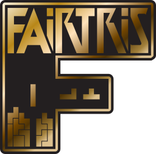

**Fair implementation of Classic Tetris®** 
Copyleft 2021-2022 furious programming. All rights reversed.

 

PC clone of the official classic **[Nintendo Tetris®](https://en.wikipedia.org/wiki/Tetris_(NES_video_game))** game for the **[NES](https://en.wikipedia.org/wiki/Nintendo_Entertainment_System)** console, intended for Windows and Linux systems. It implements and slightly extends the original mechanics, supports two themes and includes many regional versions and several random piece generators. All in one native executable.

Ready to play like a true master? **[Download the game](https://github.com/furious-programming/Fairtris/releases/download/v3.0.0.4/Fairtris_3.0_release.zip)** and show off!

  

# Compilation and developing

**[Lazarus 2.0.12](https://sourceforge.net/projects/lazarus)** was used to compile and work on the code, so you should use that as well (or a newer version if available). The **[headers for SDL2](https://github.com/PascalGameDevelopment/SDL2-for-Pascal)** are in the `source\sdl\` subdirectory, while the `.dll` libraries are in the `bin\` folder, where the executable file is created after compilation. So all you need to do is just open the project in **Lazarus** and hit the compile button.

If you are using **Free Pascal IDE** or regular text editor such as **Notepad++** or **Vim**, be sure to somehow add the **SDL** units path in the project settings and well... keep torturing yourself.

 

# What is Fairtris?

**Fairtris** is a video game, a clone of the 32-year-old **[Tetris®](https://en.wikipedia.org/wiki/Tetris_(NES_video_game))** game produced by **[Nintendo](https://www.nintendo.com)** for the **[Famicom](https://en.wikipedia.org/wiki/Nintendo_Entertainment_System)** and **[NES](https://en.wikipedia.org/wiki/Nintendo_Entertainment_System)** consoles, designed for modern Windows and Linux systems. **Fairtris is not an emulator** — it is a full-fledged game, created from scratch in **[Free Pascal](https://www.freepascal.org)** language (using the **[Lazarus IDE](https://www.lazarus-ide.org)**) and with **Direct3D** and **OpenGL** support via the **[SDL library](https://www.libsdl.org)**. Thanks to this combination, it is super-fast and ultra-light.

This project was initially created as a tool to test various RNG algorithms, but after some time it turned into a complete and rich video game that provides lots of fun. However, since **Tetris®** is a proprietary brand to which **[The Tetris Company](https://tetris.com/)** is entitled, **Fairtris is not a product** — it is a knowledge base for those who would like to know more about the internal mechanisms of the classic version of this game.

 

## Important features

- implementation of gameplay mechanics compatible with the **[Nintendo Tetris®](https://en.wikipedia.org/wiki/Tetris_(NES_video_game))** game,
- **DAS** mechanics fixed and spin buffering added, making the controls fabulously responsive,
- extended mechanics with basic **wall kick**, **hard-drop** and **multi-spawn soft-drop**,
- support for **EIGHT** regional versions of the game, including original **NTSC** and **PAL** versions,
- support for as many as **SEVEN** random piece generators, including the classic RNG,
- support for free **marathon** and **speedrun** modes, qualifications and matches with same piece set,
- the ability to start the game from any level up to the killscreen,
- the ability to play on a keyboard or any USB controller (with input mapping support),
- supports window mode and exclusive video mode,
- support for additional meters, such as **TRT**, **BRN**, as well as gain popup,
- stores the best results for each game region and RNG type,
- has a pause menu with the ability to quickly restart the game and change settings,
- shows the game summary screen after each game,
- support for two themes (minimalistic dark and classic skin),
- possibility to use it with **[NestrisChamps](https://nestrischamps.herokuapp.com)** and **[MaxoutClub](https://maxoutclub.com)**,
- it's light and very fast — should run smoothly even on a heavily loaded PC,
- it is fully portable, no installation required,
- and many more!

 

# Table of content

**General:**
* [Introduction](https://github.com/furious-programming/Fairtris/wiki)
* [First launch](https://github.com/furious-programming/Fairtris/wiki/first-launch)
* [Default controls](https://github.com/furious-programming/Fairtris/wiki/default-controls)

**Game screens:**
* [Introduction](https://github.com/furious-programming/Fairtris/wiki/game-scenes)
* [Prime menu](https://github.com/furious-programming/Fairtris/wiki/prime-menu)
* [Game modes:](https://github.com/furious-programming/Fairtris/wiki/game-modes)
    * [Free marathon](https://github.com/furious-programming/Fairtris/wiki/free-marathon)
    * [Free speedrun](https://github.com/furious-programming/Fairtris/wiki/free-speedrun)
    * [Marathon qualifications](https://github.com/furious-programming/Fairtris/wiki/marathon-qualifications)
    * [Marathon match](https://github.com/furious-programming/Fairtris/wiki/marathon-match)
    * [Speedrun qualifications](https://github.com/furious-programming/Fairtris/wiki/speedrun-qualifications)
    * [Speedrun match](https://github.com/furious-programming/Fairtris/wiki/speedrun-match)
* **Gameplay:**
    * [Marathon](https://github.com/furious-programming/Fairtris/wiki/marathon)
    * [Speedrun](https://github.com/furious-programming/Fairtris/wiki/speedrun)
* [Game pause](https://github.com/furious-programming/Fairtris/wiki/game-pause)
* **Game statistics:**
    * [Marathon summary](https://github.com/furious-programming/Fairtris/wiki/marathon-summary)
    * [Speedrun summary](https://github.com/furious-programming/Fairtris/wiki/speedrun-summary)
* [Game options:](https://github.com/furious-programming/Fairtris/wiki/game-options)
    * [Set up keyboard](https://github.com/furious-programming/Fairtris/wiki/set-up-keyboard)
    * [Set up controller](https://github.com/furious-programming/Fairtris/wiki/set-up-controller)

**Game specifics:**
* [Game regions](https://github.com/furious-programming/Fairtris/wiki/game-regions)
* [RNG algorithms](https://github.com/furious-programming/Fairtris/wiki/rng-algorithms)

**More help:**
* [FAQ](https://github.com/furious-programming/Fairtris/wiki/faq)
* [Acknowledgments and links](https://github.com/furious-programming/Fairtris/wiki/acknowledgments-and-links)

Click on one of the links above to go to the **[project wiki](https://github.com/furious-programming/fairtris/wiki)**. If you want, you can also check out the **[FAQ](https://github.com/furious-programming/Fairtris/wiki/faq)** page where you will find answers to basic questions.

 

# License

Information on the license can be found in the **[LICENSE](LICENSE)** file. In general, this project is completely free, you can use it for whatever purpose you want, both the entire game and parts of it. So play, share, fork, modify — do what you want, I don't give a shit about it.

 

# Bindings

**Fairtris** mainly targets 64-bit **Windows** systems, versions `Vista`, `7`, `8`, `8.1`, `10` and `11`. In the future, its clones for other platforms may appear — if someone decides to fork this repository and modify the game source code. Currently available releases:

* **[Fairtris for Windows](https://github.com/furious-programming/fairtris)** by **[furious programming](https://github.com/furious-programming)**
* **[Fairtris for Linux](https://github.com/chronoscz/fairtris)** by **[chronoscz](https://github.com/chronoscz)** (see also the **[snapcraft](https://snapcraft.io/fairtris)** release)
* **[Fairtris for ArchLinux](https://aur.archlinux.org/packages/fairtris-git/)** by **[loooph](https://github.com/loooph)**

 

# Acknowledgments and useful links

During the development of the game, and in particular during the reconstruction of the original **[Nintendo Tetris®](https://en.wikipedia.org/wiki/Tetris_(NES_video_game))** mechanics and the `CLASSIC` random piece generator used in it, I relied heavily on the knowledge contained in the article **[Applying Artificial Intelligence to Nintendo Tetris](https://meatfighter.com/nintendotetrisai)** and the source code from the **[TetrisNESDisasm](https://github.com/CelestialAmber/TetrisNESDisasm)** repository. In addition, the `TMG` and `TGM TERROR` generators was implemented based on the **[The history of Tetris randomizers](https://simon.lc/the-history-of-tetris-randomizers)** article. Huge thanks the authors of these materials for sharing their valuable knowledge.

To test some of the behavior of the original game, I used the **[FCEUX](http://fceux.com)** emulator and some modified ROMs which was also very helpful. Thanks are also due to the authors of the **[NestrisChamps](https://nestrischamps.herokuapp.com)** and **[MaxoutClub](https://maxoutclub.com)** tools, thanks to which it is possible to use **Fairtris** for an online competitive game. Many thanks to the authors of **[Lazarus](https://www.lazarus-ide.org/)**, the **[SDL2 headers](https://github.com/PascalGameDevelopment/SDL2-for-Pascal)** and the **[SDL library](https://www.libsdl.org)**. These tools allowed for the convenient creation of the **Fairtris** in a light and super-fast form.

The last dose of thanks goes to the Polish community putting a lot of work into the development of the Polish (and not only) classic **Tetris** scene, focused on the **[Classic Tetris Polska](https://discord.gg/QXPv3RSZ)** server on **[Discord](https://discord.com/)**. Thanks are also due to the **[4programmers.net](https://4programmers.net/)** and **[Free Pascal](https://forum.lazarus.freepascal.org/)** community for testing the game and feedback.
