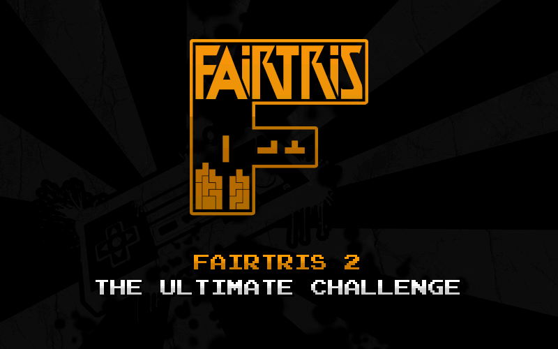

THIS DOCUMENT AND THE PROJECT WIKI ARE STILL UNDER DEVELOPMENT!

**[Fairtris 2: The Ultimate Challenge](https://github.com/furious-programming/Fairtris-2-UC)** 
Copyleft (ɔ) furious programming 2024. All rights reversed.

 

PC clone of the official classic **[Nintendo Tetris®](https://en.wikipedia.org/wiki/Tetris_(NES_video_game))** for the **[NES](https://en.wikipedia.org/wiki/Nintendo_Entertainment_System)** console and the successor to the **[Fairtris](https://github.com/furious-programming/Fairtris)** video game, intended for Windows and Linux systems. Ready to take on the ultimate challenge? **[Download the game](https://github.com/furious-programming/Fairtris-2-UC/releases/download/v2.0.0.19/Fairtris_2.0.0.19_release.zip)** and try yourself!

  

# Compilation and developing

**[Lazarus 3.2](https://sourceforge.net/projects/lazarus)** was used to compile and work on the code, so you should use that as well (or a newer version if available). The **[headers for SDL2](https://github.com/PascalGameDevelopment/SDL2-for-Pascal)** are in the `source\sdl\` subdirectory, while the `.dll` libraries are in the `bin\` folder, where the executable file is created after compilation. The compiled `.dll` libraries were downloaded from the official **[SDL repository](https://github.com/libsdl-org/SDL)**. So all you need to do is just open the project in **Lazarus** and hit the compile button.

If you are using **Free Pascal IDE** or regular text editor such as **Notepad++** or **Vim**, be sure to somehow add the **SDL** units path in the project settings and well... keep torturing yourself.

 

# What is Fairtris 2?

**[Fairtris 2](https://github.com/furious-programming/Fairtris-2-UC)** is a video game, a clone of the 32-year-old **[Tetris®](https://en.wikipedia.org/wiki/Tetris_(NES_video_game))** produced by **[Nintendo](https://www.nintendo.com)** for the **[Famicom](https://en.wikipedia.org/wiki/Nintendo_Entertainment_System)** and **[NES](https://en.wikipedia.org/wiki/Nintendo_Entertainment_System)** consoles, designed for modern Windows and Linux systems. It is the successor to the first **[Fairtris](https://github.com/furious-programming/Fairtris)** video game, with refreshed graphics, newly defined functionality and introducing a number of new features that ensure even more fun.

 

# What's new in Fairtris 2?

The first **[Fairtris](https://github.com/furious-programming/Fairtris)** was mainly an experiment to create the classic **[Tetris®](https://en.wikipedia.org/wiki/Tetris_(NES_video_game))** as a native application for modern platforms, using all available knowledge about the structure and operation of the official **[Tetris®](https://en.wikipedia.org/wiki/Tetris_(NES_video_game))** from **[Nintendo](https://www.nintendo.com/)**. I consider the experiment to be a complete success, and in the meantime, the classic **Tetris®** scene has moved forward significantly, drastically pushing the boundaries of what is possible. 

**Maxout is no feat today** — currently the best players in the world know no limits, they can go so far that the classic **[Tetris®](https://en.wikipedia.org/wiki/Tetris_(NES_video_game))** gives up, starts rendering game frames with glitched colors, or even crashes and goes into soft lock. The first to do this was **[Blue Scuti](https://www.youtube.com/watch?v=GuJ5UuknsHU)**, and his achievement in the form of a game crash became an incredible sensation, which was even reported by the media around the world. Soon, others joined this elite, including **[Fractal](https://www.youtube.com/watch?v=Hr_Reo8GRu0)** and **[PixelAndy](https://www.youtube.com/watch?v=sx2qPhPb5iQ)** (as of the date of writing this document). This was the main impulse for creating the **[Fairtris](https://github.com/furious-programming/Fairtris)** sequel, it was time to take the next step.

## Removed [NES Tetris®](https://en.wikipedia.org/wiki/Tetris_(NES_video_game)) compatibility

**[Fairtris 2](https://github.com/furious-programming/Fairtris-2-UC)** has been redefined, new goals have been defined. The decision has been made to discontinue compatibility support with classic **[Tetris®](https://en.wikipedia.org/wiki/Tetris_(NES_video_game))** and tools such as **[NestrisChamps](https://nestrischamps.herokuapp.com/)** and **[Maxout Club](https://maxoutclub.com/)**. The new version should have the shape of a typical game, not an experimental tool for testing various algorithms. Everything related to compatibility with the progenitor has been removed. This is mainly about the classic theme and aspect ratio, as well as the classic, clumsy control mechanics and **hard-drop**, which was an experiment. Transition to level `19` no longer has any significance, and there is no killscreen at level `29`, which is such a high speed of falling pieces that further play becomes practically impossible. Speedrun and qualification modes have also been removed, as well as support for setting a fixed seed for RNG.

## New game design and aspect ratio

The new version of **[Fairtris](https://github.com/furious-programming/Fairtris-2-UC)** has one, richer graphics design and the game image is rendered in `16:10` aspect ratio, which is the standard for modern LCD displays. Instead of flat characters, piece bricks and other game objects, the new version uses more colors and subtle gradients, as well as more animated elements, including the main background for all game scenes. Two-color counters for various game counters were also used, with dark gray placeholders resembling electronic displays. Now it feels more like a **[SNES](https://en.wikipedia.org/wiki/Super_Nintendo_Entertainment_System)** game instead of an **[NES](https://en.wikipedia.org/wiki/Nintendo_Entertainment_System)** game.

## Unified control mechanics

The controls have been unified, only the best mechanics have been selected, ensuring the best responsiveness and intuitive control, and adapting them to the new game goals. Instead of supporting the classic control mechanics, it is now possible to set the speed of automatic shifting of pieces, called **[DAS](https://www.youtube.com/watch?v=JeccfAI_ujo)**. By default, the speed is consistent with its predecessor, but more experienced players can increase it to be able to stack higher and wait longer for the longbar.

## New game goal

In the first **[Fairtris](https://github.com/furious-programming/Fairtris)**, just like in the classic **[Tetris®](https://en.wikipedia.org/wiki/Tetris_(NES_video_game))**, the goal was to collect as many points as possible and reach level `29`, at which most of the time the game ended (killscreen). **[Fairtris 2](https://github.com/furious-programming/Fairtris-2-UC)** does not have any killscreen limitations. The maximum falling speed of the pieces has been set to that of level `19`, which ensures an infinitely long gameplay. However, this still does not change the fact that playing at this speed is difficult and requires a lot of experience, so the bar is still set high.

To diversify the gameplay, support for glitched colors of pieces and stack bricks has been added, consistent with that existing in **[Nintendo Tetris®](https://en.wikipedia.org/wiki/Tetris_(NES_video_game))**. These glitched colors, as in the original, are used at levels `138` to `255`, which requires clearing over `1,300` lines. In the original, the pieces in some levels were black and therefore almost invisible, which made playing very difficult. Since the new version of **[Fairtris](https://github.com/furious-programming/Fairtris-2-UC)** uses gentle gradients, also for pieces and the content of the stack, the colors can be consistent with the predecessor while not being unfair.

The ultimate challenge is to pass level `255`, which in **[Nintendo Tetris®](https://en.wikipedia.org/wiki/Tetris_(NES_video_game))** caused the level counter to overflow and return to level `0`. **[Fairtris 2](https://github.com/furious-programming/Fairtris-2-UC)** has a special handling of such a situation and a reward for the player for achieving such an outstanding achievement. Beating level `255` results in... it's a secret — It's up to you to discover what it is!

## Other improvements

The new version has dozens of minor improvements and novelties, making the game's operation and controls richer and even more convenient, ensuring a better experience. It's hard to list all differences — just everything that could be improved and added was improved and added.

## Important features

- game mechanics inspired by those from the **[Nintendo Tetris®](https://en.wikipedia.org/wiki/Tetris_(NES_video_game))** video game,
- **[DAS](https://www.youtube.com/watch?v=JeccfAI_ujo)** mechanics fixed and spin buffering added, making the controls fabulously responsive,
- ability to change the speed of shifting pieces according to your preferences,
- extended mechanics with basic **wall kick** and **multi-spawn soft-drop**,
- capped the maximum falling speed of pieces to that consistent with level `19`,
- support for **NTSC** and **PAL** regions (60fps and 50fps respectively),
- support for as many as **SEVEN** random piece generators, including the classic RNG,
- **support for glitched original color palettes of pieces, on levels** `138` **to** `255`,
- **secret after beating level** `255`,
- the ability to start the game from any level up to the level `19`,
- the ability to play on a keyboard or any USB controller (with input mapping support),
- supports window mode and exclusive video mode, for maximum performance and responsiveness,
- support for additional meters, such as **tetrises**, **burned**, as well as **gain** popup,
- stores the best results for each game region and RNG type,
- has a pause menu with the ability to quickly restart the game and change options,
- shows the game summary screen after each game,
- it's light and very fast — should run smoothly even on a heavily loaded PC,
- it is fully portable, no installation required,
- and many more!

 

# License

Information on the license can be found in the **[LICENSE](LICENSE)** file. In general, this project is also completely free, you can use it for whatever purpose you want, both the entire game and parts of it. So play, share, fork, modify — do what you want, I still don't give a shit about it.

 

# Bindings

**[Fairtris 2](https://github.com/furious-programming/Fairtris-2-UC)** mainly targets 64-bit **Windows** systems, versions `Vista`, `7`, `8`, `8.1`, `10` and `11`. In the future, its clones for other platforms may appear — if someone decides to fork this repository and modify the game source code. Currently available releases:

* **[Fairtris 2 for Windows](https://github.com/furious-programming/fairtris-2-uc)** by **[furious programming](https://github.com/furious-programming)**

 

# Acknowledgments and useful links

In addition to the **[previously gained knowledge](https://github.com/furious-programming/Fairtris#acknowledgments-and-useful-links)**, useful to create the first **[Fairtris](https://github.com/furious-programming/Fairtris)** video game, during the development of **[Fairtris 2](https://github.com/furious-programming/Fairtris-2-UC)** the **[FCEUX](https://fceux.com/)** emulator and a modified ROM of the original **[Nintendo Tetris®](https://en.wikipedia.org/wiki/Tetris_(NES_video_game))**, called **[TetrisGYM](https://github.com/kirjavascript/TetrisGYM)**, were used. Many thanks to the authors of **[Lazarus](https://www.lazarus-ide.org/)**, the **[SDL2 headers](https://github.com/PascalGameDevelopment/SDL2-for-Pascal)** and the **[SDL library](https://www.libsdl.org/)**. These tools allowed for the convenient creation of the **[Fairtris 2](https://github.com/furious-programming/Fairtris-2-UC)** in a light and super-efficient form.

The animation of the game's main background is modeled on the one from the main menu of **[Chase Ace 2](https://youtu.be/g08CSSpd05k?si=zWTetw4z7RbcHHgF&t=107)**, developed and published by the **Space Time Foam** team.
